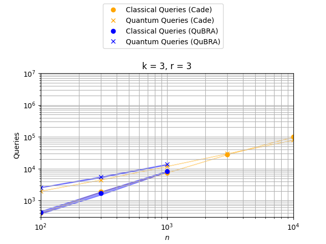

# QuBRA Benchmarking Framework [](https://github.com/qubrabench/qubrabench/actions/workflows/ci.yaml)

_qubrabench_ is a Python library for estimating quantum computing performance compared to classical algorithms.

The idea generalizes on the work by [Cade et al.](https://arxiv.org/abs/2203.04975) by providing classical implementations of algorithms and subroutines (e.g., `search` or `max`), that can be accelerated on a quantum computer.
These implementations are instrumented in such a way that when they are run, they track not only certain classical cost metrics, but also quantum cost metrics, i.e., costs that would be incurred if one were running the same algorithm with the same data on a quantum computer.

The collected classical costs can then be compared with the estimated quantum costs to obtain insight into when a quantum advantage might be achieved given a particular problem size or data set.

Eventually, this projects provides example algorithms and problem data sets for different industry relevant use cases such as _Configuration Selection_, _Job Shop Scheduling_, _Supply Chain Management_ and more.

By providing an API to the subroutines subject to quantum speedups, this project aims to ultimately be able to replace the classical execution of a subroutine with execution on an actual quantum backend.

## Installation

To install and use this project, download or check out this repository, and install it with the package manager [pip](https://pip.pypa.io/en/stable/) (using a virtual environment is advised):

```shell
pip install .
```

We recommend the use of Python 3.10 or 3.11.

## Usage

### API Use

Generally, you will have to create an instance of a statistics object such as `QueryStats`, that you can pass into our API found in `qubrabench/algorithms` and later evaluate. You can then replace subroutines in your own example with the according counterpart of our API and leave the rest of your codebase untouched.

The best place to start familiarizing yourself with this workflow is [hillclimber.py](examples/sat/hillclimber.py). For plotting and providing a command line interface of an algorithm see [bench_hillclimber.py](examples/sat/bench_hillclimber.py).

### Run Existing Benchmarks

To benchmark the example hillclimber algorithm for MAX-k-SAT with multiple input sizes, you can run the [bench_hillclimber.py](examples/sat/bench_hillclimber.py) script.
Run `./examples/sat/bench_hillclimber.py -h` to obtain an overview over the available commands of this example.

To aggregate benchmarking data, run you can run the following example to produce 5 runs of `k=3` SAT problems. In this example, `k` is the number of literals in a clause, `n` is the total number of variables and `r` is a factor for determining the number of clauses `m = r * n`. A path to the desired output can be provided after the `--save` flag.

```shell
./examples/sat/bench_hillclimber.py hill-climb -k 3 -r 3 -n 100 --runs 5 --save sat.json
```

In this case, the generated data is stored in the `sat.json` file.

As one will often want to benchmark algorithms for multiple choices of problem sizes and other parameters, using a shell script to execute multiple benchmarks in a batch can be useful.
See [Makefile](Makefile) for an example.

### View Benchmark Results

To generate a plot, you first need to run benchmarks and thereby populate a JSON output file, like the `sat.json` file in the example above.
Once this is done, you can generate a plot based on this file by running the script `./examples/sat/bench_hillclimber.py plot <path-to-file>`.

You can also use the targets of the [Makefile](Makefile) to run predefined benchmarking sets and view the plots.
The following plot is produced by the command:
```shell
make bench-hillclimber-quick
```




## Contributing
Pull requests are welcome. For major changes, please open an issue first
to discuss what you would like to change.

Please make sure to update tests as appropriate.

Detailed documentation on how to contribute to this project and best practices can be found in the [DEVELOP.md](DEVELOP.md) file.

---

This work has been supported by the German Ministry for Education and Research (BMBF) through project "Quantum Methods and Benchmarks for Resource Allocation" (QuBRA).
