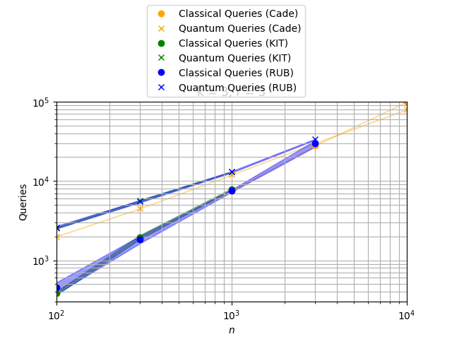

# QuBRA Benchmarking Framework

This framework is based on the paper "Quantifying Grover speed-ups beyond asymptotic analysis" by Cade et al.
The aim of this framework is to compare the performance (number of calls) of algorithms using a classical approach to the same algorithms with user-defined classical subroutines being replaced by quantum calls.
This is thereby a substitute to the usual method of comparing runtimes by asymptotic, worst-case analysis.

## How benchmarks work

The framework runs an algorithm (e.g., Hill-Climber to solve MAX-k-SAT) with a classical approach and records the number of calls necessary to solve a randomly generated problem instance.
Any subroutine can be annotated to indicate to the framework, that it is to be replaced by a quantum call.
Using numerical assumptions on the runtime of quantum algorithms based on the classical data, the framework estimates the number of calls necessary to solve the problem instance, when the annotated subroutine is replaced by a quantum call.
The data is stored in a JSON file, form which a graph comparing the two approaches (classical vs. quantum) can be generated.

## How to install

To install and use this framework, simply download or check out this repository, and install it (using a virtual environment is advised):

```shell
pip install .
```

If you are interested in *developing* `qubra_bench`, please see below for instructions.

## How to run a benchmark

To benchmarks the hill-climber algorithm for MAX-k-SAT for multiple input sizes, you can run the `qubrabench.py` script:

```
./qubrabench.py hill-climb RUB -k 3 -r 3 -n 100 --runs 5 --save satfix.json
./qubrabench.py hill-climb KIT -k 3 -r 3 -n 100 --runs 5 --save satfix.json
```

**TODO:** Add explanation of the parameters.  
**TODO:** There should be some default for RUB vs KIT.

In this case, the generated data is all stored in the `satfix.json` file.

As one will often want to benchmark algorithms for multiple choices of problem sizes and other parameters, using a shell script to execute multiple benchmarks in a batch can be useful.
See [Makefile](Makefile) for an example.

## How to generate a plot

To generate a plot, you first need to run the framework and thereby populate a JSON output file, like the `satfix.json` file in the example above.
Once this is done, you can generate a plot based on this file by running the command `./qubrabench.py plot <path-to-file>`.




# Development

Detailed documentation on how to contribute and best practices can be found in the [DEVELOP.md](DEVELOP.md) file.