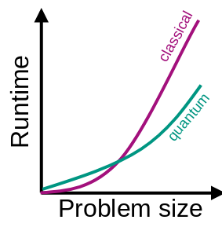

# QuBRA Benchmarking Framework [](https://github.com/qubrabench/qubrabench/actions/workflows/ci.yaml)

_qubrabench_ is a Python library for estimating quantum computing performance compared to classical algorithms.

The idea generalizes on the work by [Cade et al.](https://arxiv.org/abs/2203.04975) by providing classical implementations of algorithms and subroutines (e.g., `search` or `max`), that can be accelerated on a quantum computer.
These implementations are instrumented in such a way that when they are run, they track not only certain classical cost metrics, but also quantum cost metrics, i.e., costs that would be incurred if one were running the same algorithm with the same data on a quantum computer.

The collected classical costs can then be compared with the estimated quantum costs to obtain insight into when a quantum advantage might be achieved given a particular problem size or data set.

<p align="center">
    
</p>

Eventually, this projects provides example algorithms and problem data sets for different industry relevant use cases.

By providing an API to the subroutines subject to quantum speedups, this project aims to ultimately be able to replace the classical execution of a subroutine with execution on an actual quantum backend.

## Installation

To install and use this project, download or check out this repository, and install it with the package manager [pip](https://pip.pypa.io/en/stable/) (using a virtual environment is advised):

```shell
pip install .
```

We recommend the use of Python 3.10 or 3.11.

## API Use

Generally, you will have to create an instance of a statistics object such as `QueryStats`, that you can pass into our API found in `qubrabench/algorithms` and later evaluate. You can then replace subroutines in your own example with the according counterpart of our API and leave the rest of your codebase untouched.

For example, consider you want to benchmark the following example algorithm:
```python
elements = [1, 2, 3, 4, 5]
target = 3
# find the target in elements
for element in elements:
    if element == target:
        result = element
        break
```

After importing the relevant modules and creating a statistics object, you will have to adjust your code to leave iterating over your search space to `qubrabench`. 
Your statistics object will automatically accumulate benchmarking data.
Your example algorithm will now resemble something like this:

```python
from qubrabench.stats import QueryStats
from qubrabench.algorithms.search import search

elements = [1, 2, 3, 4, 5]
target = 3
stats = QueryStats()

# deterimine whether x is the target
def predicate(x):
    return x == target

# find target in elements
result = search(elements, predicate, stats=stats)
```

The best place to start familiarizing yourself with this workflow is [hillclimber.py](examples/sat/hillclimber.py). For plotting and providing a command line interface of an algorithm see [bench_hillclimber.py](examples/sat/bench_hillclimber.py).


## Contributing
Pull requests are welcome. For major changes, please open an issue first
to discuss what you would like to change.

Please make sure to update tests as appropriate.

Detailed documentation on how to contribute to this project and best practices can be found in the [DEVELOP.md](DEVELOP.md) file.

---

This work has been supported by the German Ministry for Education and Research (BMBF) through project "Quantum Methods and Benchmarks for Resource Allocation" (QuBRA).
